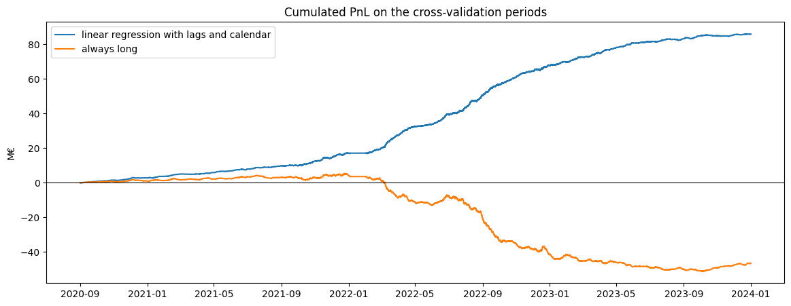
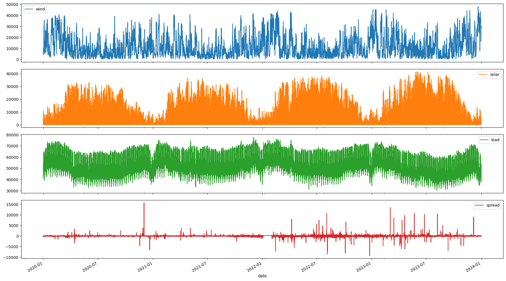
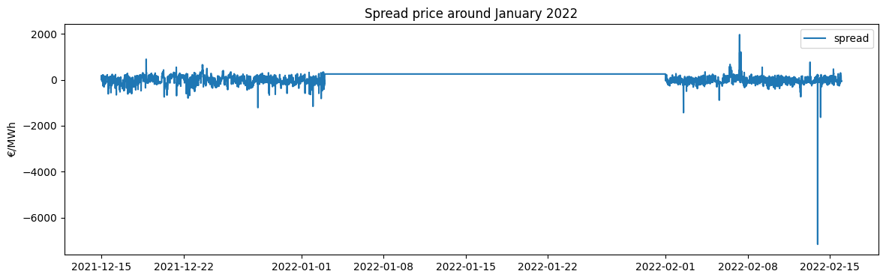

# Engelhart data challenge : Trading German electricity market 

During the Ensimag technology conference, **Engelhart** gave us a data challenge: predict every 15 minutes whether the German electricity grid will be short or long of power, and trade on it. After the challenge, their team (Tanguy Esteoule and Stenzel Cackowski) walked us through their own solution. This repo is my rebuild of that approach.



## The challenge

The reference price for electricity is set the day before delivery, on the day-ahead market. On the delivery day, the grid is never perfectly balanced: if there is not enough energy, the price of the energy used to rebalance it (the **imbalance price**) goes up; if there is too much, it goes down.

The idea is to bet on this gap every 15 minutes:

**spread = imbalance price − day-ahead price**

- spread > 0: the grid is tighter than expected -> better to **buy** on the day-ahead market
- spread < 0: the grid has a surplus -> better to **sell** on the day-ahead market

The trading rule is fixed by the challenge: if my forecast is >= 0, I buy 50 MW, otherwise I sell 50 MW, and I don't trade when the imbalance price goes above 1000 € in absolute value (too risky). The score is the cumulated PnL.

## The data

| File | Content |
|---|---|
| `train.csv` | 2020 to 2023: wind, solar and load forecasts (MW) and the spread (€/MWh), every 15 min |
| `test.csv` | January to September 2024: forecasts only, the spread has to be predicted |
| `imbalances.csv` | imbalance price on the train period, used to compute the PnL in cross-validation |




## The approach

### 1. Cleaning the data (a month of fake spread)

When the Engelhart team presented their solution, they pointed out a data issue in January 2022: the spread is stuck at exactly 250 € for almost a month while the imbalance price keeps moving normally. A difference between two prices can't stay constant for a month, so the day-ahead price was most likely missing and replaced by a fixed value.



I removed these periods from training (the model would learn a relationship that doesn't exist) and from the evaluation.

### 2. The model

A linear regression, with two kinds of variables on top of the raw forecasts:

- **Lags**: the value of wind, solar and load 15, 30, 45 and 60 minutes before. The spread does not only depend on the level of production and consumption but also on how fast they change.

- **Calendar variables**: hour, weekday and month, as dummy variables. The spread has a clear daily profile (rather positive at night, negative in the evening).

No lag of the spread itself: positions are taken the day before, so when trading 10:00, the spread of 9:45 is not known yet (and the test set has no spread column anyway).

### 3. The evaluation

The data is a time series, so the cross-validation uses `TimeSeriesSplit`: always train on the past, validate on the following block. To give a scale to the results, the model is compared with two benchmarks, on exactly the same periods:

- **always long**: buy 50 MW every period, no model at all
- **perfect foresight**: knowing the true sign of the spread, i.e. the maximum PnL you could get

## Results

| Strategy | Cumulated PnL | % of perfect foresight |
|---|---|---|
| Always long | −46.5 M€ | −7.9 % |
| **Linear regression with lags and calendar** | **86.0 M€** | **14.5 %** |
| Perfect foresight | 591.0 M€ | 100 % |


## Run it

```bash
jupyter notebook challenge_notebook.ipynb
```

The notebook reads the CSV files from the same folder and writes `submission.csv` at the end.

## Repository

```
├── challenge_notebook.ipynb   # the whole analysis
├── train.csv
├── test.csv
├── imbalances.csv
├── images/
└── README.md
```